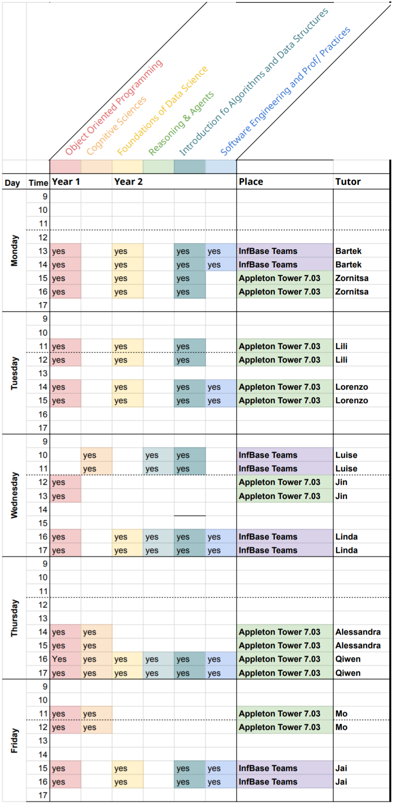

**Shortcut menu**: [Supported Courses](#supported-courses)---[Join](#join-an-infbase-session)---[Schedule](#schedule)---[Feedback](feedback.html)---[Tutor FAQ](tutor-faq.html)

# What is InfBase

InfBase is a drop-in helpdesk for year-1 and year-2 students to get additional tutoring and support with their specific course content.

InfBase is run by students in higher years with of expertise and who offer 1-on-1 support and advice on core pre-honours courses in Informatics. In addition to supporting drop-in assistance, InfBase can be used as a place to work together with other students, with support from an InfBase tutor.

Some sessions will run online (MS Teams), other sessions will run in Appelton Tower 7.03 (7th floor). Please check the below schedule for reference. 

If you have suggestions and feedback for InfBase, please [let us know how we are doing](feedback.html).

## Supported Courses 

__Semester 1:__
* Year 1: Informatics 1 - Introduction to Computation
* Year 2: Informatice 2 - Foundations of Data Science
* Year 2: Informatice 2C - Introduction to Computer systems
* Year 2: Informatics 2 – Introduction to Algorithms and Data Structures
* Year 2: Discrete Maths and Probability 

__Semester 2:__
* Year 1: Informatics 1 - Object Oriented ProgrammingYear 1: Informatics 1—Cognitive Science
* Year 1: Informatics 1 - Cognitive Science 
* Year 2: Informatics 2 - Software Engineering and Professional Practice
* Year 2: Informatice 2C - Foundations of Data Science
* Year 2: Informatice 2D - Reasoning & Agents

## Join an InfBase Session

Some sessions will run online (MS Teams), other sessions will run in Appelton Tower 7.03 (7th floor). Please check the below schedule for reference. 

Online sessiosn for InfBase will run on its dedicated [Teams team](https://teams.microsoft.com/l/team/19%3a1b9574ccbc404c2d93699fe1bf833b6b%40thread.tacv2/conversations?groupId=a9555449-ddb5-4747-8fc6-1f6bad927c8a&tenantId=2e9f06b0-1669-4589-8789-10a06934dc61) which is open to everyone. The channel is public to all students and you find the drop-in sessions in the General channel. Just join the call during the sessions times. During the sessions times, see the schedule below in week 2, a tutor will be around to help you with your questions. Questions may be answered publicly. If you do not wish to speak up, it’s OK to type your question into the chat. 

If you wish to create an online study group, you can create dedicated channels in the InfBase team for your chats and calls. If a tutor is available, you may ask them to join your learning group.

## Schedule

Regular InfBase sessions start in Week 3 (Monday, January 31st, 2022) and will run until the end of revision week. Each session runs for 2 hour (e.g., Monday 1pm-3pm) and is supported by a tutor (last column). Not all sessions can cover all courses. 

